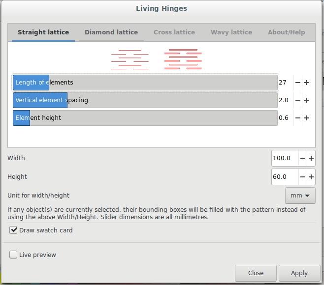

# Inkscape lasercut living hinge extension

This is an extension for Inkscape to render Living Hinges.

Living hinges are patterns that can be laser cut into materials such
as wood and acrylic, allowing them to be bent into surprisingly tight
radii.

This extension is primarily built for Inkscape 1.0 and above.

For version 0.92 there is also a port in the Github `0.92` branch.

## Installation

### Inkscape 1.0+

Download the archive and extract it such that all of the files are
contained in a *sub-folder* of your extensions folder.

Your extensions folder can be found at `Edit->Preferences->System->User Extensions`

On Linux, this is usually:

`~/.config/inkscape/extensions`

On windows it's usually:

`c:\Users\<username>\AppData\Roaming\inkscape/extensions`

### Inkscape 0.92

You will need to download the archive from the Github `0.92` branch.

Download that archive, and extract the files `living_hinge.inx` and
`living_hinge.py` into your extensions folder (see above for the location).

## Usage

The extension is found in `Extensions->Render->Living Hinge...`

Input the width and height of the desired pattern and then apply (or
live preview).  
If an object is currently selected, the extension will fill the object's
bounding box instead of using the size inputs.

Choose the type of pattern you'd like by selecting its tab. Adjust the
parameters as needed. Play with the sliders in Live Preview mode
to find the optimal values and click Apply to use it.

The extension will round some of the parameters up or down in order to
fill the desired area evenly.

To get a better bounding box by the edge, you can draw a bounding path
around the desired area afterwards, then select `Path->Intersection`
to limit the pattern to exactly that path.

## Patterns

The currently supported patterns are:

Straight lattice:

Diamond lattice:

Cross lattice:

Wavy Lattice:

## Contributions

Contributions are welcome, such as for more or improved patterns, etc.

## Licence and contact

Author: Ben Buxton (bbuxton@gmail.com)
Licence: GPLv3
